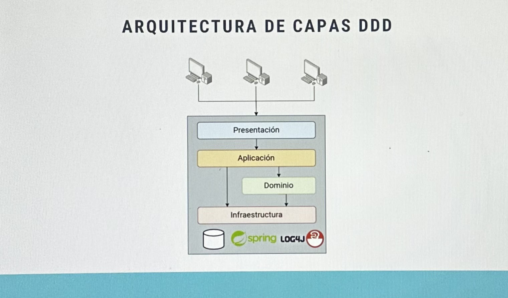

## Capas de Arquitectura DDD

### Capa de Presentacion

API de entrada a nuestro sistema que da soporta a la interfaz de usuario, ya sea una aplicacion web, movil o cualquier otro tipo de cliente.

Es la fachada e interactua con los servicios de aplicacion para iniciar los casos de uso que se necesiten.

> En frameworks como Spring serian los **@Controller**

Cabe acotar que la capa de presentacion no es equivalente a la interfaz de usuario. En el pasado, se contruia la vista desde el servidor por eso **se consideraba parte de la presentacion**. Ahora es muy comun tener la vista separada en otro proyecto, como una SPA (Single Page Application) o una aplicacion movil; utilizando frameworks como React, Angular, Vue, etc.

### Capa de Aplicacion

Es la encargada de **orquestar** todos los **casos de uso** necesarios para resolver las peticiones de la capa de presentacion.

**Interactura con el dominio** para ejecutar su logica especifica.

**Interactura con la infrastructura** para persistencia, framework, logging, etc.

**Respone a la capa de presentacion** con los resultados de los casos de uso ejecutados.

> En frameworks como Spring serian los **@Service**

### Capa de Dominio

En esta capa residen los **datos y logica central de nuestro sistema**, diseñada bajo los principios DDD.

Esta capa debe estar **lo mas aislada posible del exterior**. Se comunica con la capa de infraestructura  si necesita algun acpecto de logging. 

La capa de dominio no debe saber nada ni de casos de uso de nuestro sistema, ni tampoco detalles de implementacion como podria ser el framework o la base de datos utilizada.

Se compone de entidades de dominio y servicios de dominio. Las entidades de dominio son las que contienen los datos y la logica necesarias para representar el dominio del problema.

- Entidades de dominio:
  - Datos y logica; clases y modulos planos.
  - **NO** son entidades de persistencia (**@Enitty** en Spring), no son tablas de base de datos.

- Servicios de dominio:
  - contiene logica de dominio que no se pueda asignar a una entidad de dominio especifica.
  - Siguen los principios del DDD.
  - **@Service** en Spring, pero no son servicios de aplicacion.
  - Estos servicios pertenecen al lenguage ubicuo del dominio y estan claramente definidos y documentados.

> **NOTA ADICIONAL**
> 
> El uso de @Service de Spring en la capa de dominio contrasta con que la capa de dominio debe estar aislada de la infraestructura, pero evidentemente en el mundo del software no hay nada blanco o negro, es todo una escala de grises.
>
> Aunque siempre es mejor que los servicios de dominio tampoco tengan conocimiento sobre el framework que estamos utilizando, puede ser aceptable utilizarlo como es el caso de @Service de Spring, que simplemente es una anotacion que nos permite inyectar ese servicio en otra clase, consiguiendo asi la inversion de la dependencia. 

### Capa de Infraestructura

Es la capa que interactura con todos los detalles de implementacion especificos como son las persistencia, detalles de framework y otros aspectos de infraestructura.

- Persistencias:
  - Objetos de ORMs (@Entity, etc)
  - Repositorios
- Detalles del Framework
  - Clases de configuracion
  - Arranque de aplicacion
- Otros aspectos de infraestructura
  - Logging
  - Clases de Configuracion
  - etc.

### Dependencias

- **Las flechas indican el flujo de la informacion**, no la dependencia.
- Es importante conseguir la **IoC** (Inversion of Control) usando tecnicas como la inyeccion de dependencias.
- Es importante que el **dominio sea lo mas estable** de nuestro sistema.
- Nunca debemos modificar nuestro dominio para adaptarlo al exterior, como por ejemplo base de datos, frameworks, etc cualquier detalle de implementacion.
- En ese caso, lo apropiado es adaptar la capa de infraestructura. Siempre debemos modificar primero capas exteriores al dominio, y nunca al reves.
- La capa de dominio no se debe modificar nunca (se refiere a codigo ya existente), solo se debe agregar nueva funcionalidad.
- Evidentemente esta capa debe cumplir el principio Solid de **Open Closed Principle** (Principio Abierto/Cerrado), es decir, debe estar abierto para agregar nueva funcionalidad, pero cerrado para modificaciones.