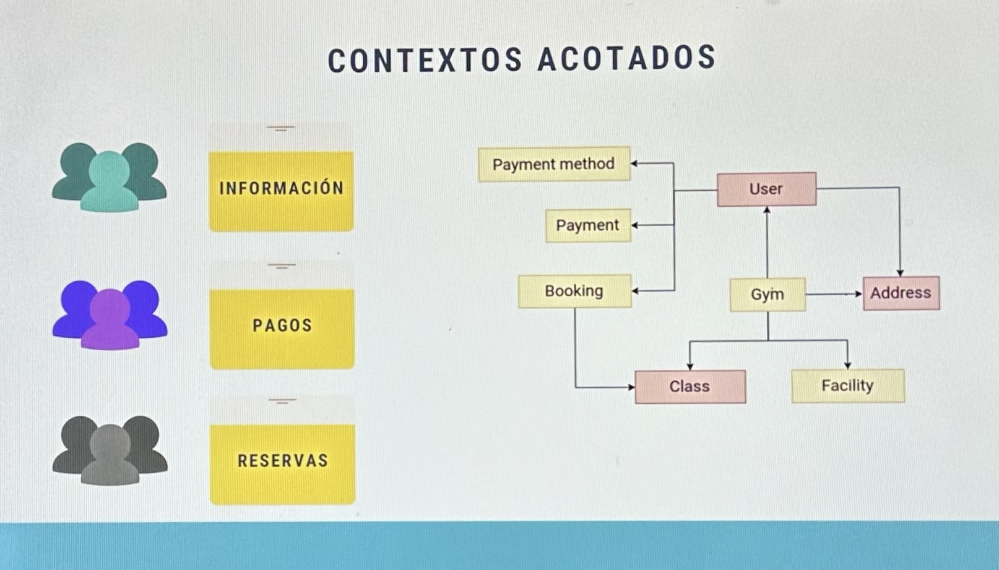
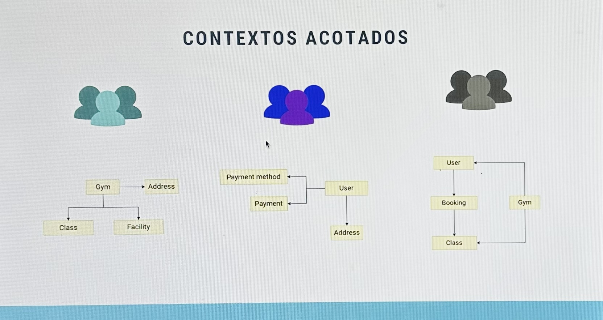
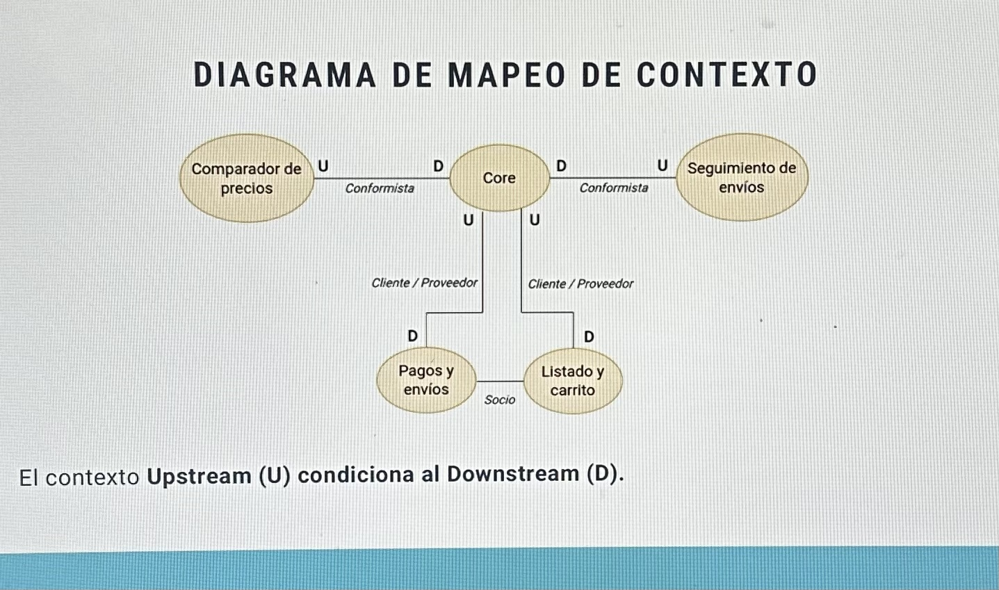

## Bounded Contexts (Contextos Acotados)

En este diagrama, se identifican diferentes funcionalidades: pagos, reservas e informacion del gimnasio. Que ademas comparten informacion entre ellas.

Es comun que cuando el sistema crece, se divide el trabajo en diferentes equipos, asignando cada uno a una funcionalidad y sus entidades asociadas. Y tienen que trabajar en algunos casos en las entidades compartidas, como ser:

- La entidad `direcciones` es utilizada por los equipos de **Informacion** y **Pagos**.
- La entidad `clases` es utilizada por los equipos de **Informacion** y **Reservas**.
- La entidad `usuarios` es utilizada por todos los equipos.

Haciendo que las modificacioens que haga algun equipo sobre estas entidades compartidas afecten indirectaqmente a los otros equipos.

A continuacion se muestra una mejor forma de diseñar el modelo de nuestra aplicacion:

En este diagrama, cada equipo tiene su propio bounded context, lo que significa que cada uno tiene su propio modelo de datos y logica de negocio.

Cada equipo es responsable de su propio contexto y no tiene que preocuparse por los detalles internos de los otros contextos. Esto permite una mayor independencia y flexibilidad en el desarrollo.

Evidentemente, cada contextos no son totalmente independientes entre si, se sigue necesitando que los contextos cooperen entre si para conseguir una funcionalidad completa.

### Definicion de Bounded Context

Nueva forma de organizr el modelo y logica de negocio **guiado por el dominio**.

- Un contexto acodado es aquel que tiene un sentido especial en el dominio; al final es un sudominio dle dominio completo del problema.
- Cada bounded context tiene su **propio lenguaje ubicuo**.
- Las entidades fuera del `bounded context` pueden tener caracteristicas ligeramente diferentes.

Notas Importantes:
> Tener definida la misma entidad en diferentes contextos **no implica una duplicidad de codigo, sino una aclaracion del mismo**.
>
> Compartiendo el modelo entre contextos, se tiende a acumular detalles e informacion entre ellos, **poniendo en riesgo la integridad del modelo**.

## Mapeo de Contextos

### Dependencias entre distintos contextos

A pesar de que es positivo separar nuestro modelo en bounded contexts, la logica de un sistema de software complejo implica **interaccion entre los distintos contextos**.

- Los contextos no son totalmente independientes entre si.
- Se deben definir claramente las **dependencias** e **interaciones** entre los distintos contextos.

Tipos de relaciones entre contextos:

- **Conformist (Conformista)**. No existe ninguna capacidad de negociacion entre los contextos. El contexto dependiente acepta el modelo del contexto proveedor sin cuestionarlo.
- **Cliente/Proveedor (Customer/Supplier)**. Dependencia con cierto grado de negociacion. El contexto cliente puede solicitar cambios al contexto proveedor, pero este no esta obligado a realizarlos.
- **Partnership (Asociacion)**. Relacion de colaboracion entre contextos. Ambos contextos trabajan juntos para definir el modelo y las interacciones.
- **Shared Kernel (Nucleo Compartido)**. Dos o mas contextos comparten un modelo comun, pero cada uno tiene su propia implementacion. Se requiere una colaboracion estrecha para mantener la coherencia del modelo compartido. Es dificil de mantener y requiere una gran disciplina.
- **Anticorruption Layer (Capa de Anticorrupcion)**. Interfaz que utiliza `Downstream` para interactuar con `Upstream`, sin importar los cambios realizados en el ultimo. Se utiliza para evitar que un contexto externo afecte negativamente a nuestro modelo. Actua como una capa de traduccion entre los dos contextos, permitiendo que cada uno mantenga su propio modelo sin contaminarse mutuamente.
- **Open Host Service/Published Language**. Relaciones de tiupo **conformist** en las que se provee de documentacion al `Downstream` context para que pueda interactuar con el `Upstream` context. El `Upstream` context define un lenguaje de publicacion que el `Downstream` context puede utilizar para interactuar con el `Upstream` context. Ademas se proporciona **versiones** y compatibilidades entre ellas.