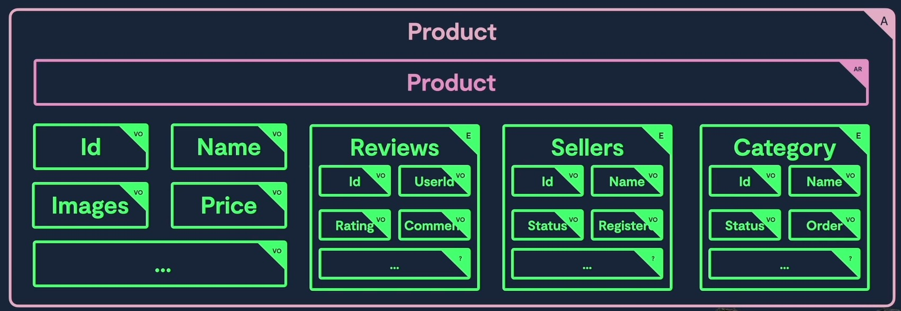

## Modelado de Dominio

Por poner un ejemplo, pensemos en el caso de una compañia de software que se divide en equipo de X miembros que trabajan en diferentes proyectos.

Cuando empezamos a modelar en el dominio, lo normal es empezar a definir las entidades de dominio y sus relaciones. Las entidades que vemos aqui son: Equipo, Proyecto y Miembro.

Ademas, existen ciertos atributos relacionados con cada entidad, como son:
- `estado` y `categoria` de un proyecto.
- `direccion` y `rol` de un miembro.
- `departamento` de un equipo.

Estos son conocidos como objetos de valor, **Value Objects**, que son objetos que no tienen identidad propia, sirven como atributos de nuestras entidades, solo tienen datos y no implementan nignuna logica. Por ejemplo, un objeto de valor `Direccion` puede tener atributos como `calle`, `numero`, `ciudad`, etc.

Tambien podemos observar, tenemos 3 conceptos claramente diferenciados: Proyectos, Equipos y Miembros. Cada uno de estos conceptos diferentes es conocido como **Aggregate**. Cada Aggregate tendra una entidad raiz, en este caso las entidades `Proyecto`, `Equipo` y `Miembro`, ademas de ValueObjects relacionados.

Tambien pueden existir entidades secundarias en lo **Aggregates**. Estas entidades tienen datos y logica, pero no son la entidad raiz del Aggregate. Por ejemplo, en el caso de un `Proyecto`, puede existir una entidad secundaria llamada `Tarea`, que tiene datos y logica relacionada con las tareas del proyecto, pero no es la entidad raiz del Aggregate.

### Elementos del Modelo de Dominio

**Entidades**.
- Clases con datos y comportamiento.

**Value Objects (Objetos de Valor)**. 
- Clases con datos, sin comportamiento.
- Sirven para representar de manera mas clara los atributos de las entidades.
- No tienen identidad propia, son inmutables.
- Evitar la exposicion o uso de los value-objects fuera el dominio.

**Aggregates**
- Grupos de entidades y Value Objects.
- Separan conceptos diferentes de nuestro dominio.

> Como norma general, la comunicacion entre distintos Aggregates se realiza a traves de la raiz de los mismos. Una raiz no puede acceder a otro elemento no raiz de un aggregate directamente.
>
> Por ejemplo, si necesitamos modificar el `rol` de un miembro de un equipo, esto se debe hacer a traves de la entidad `miembro` y no accediendo directamente al value object `rol`. Con esto nos aseguramos de que cada Aggregate sea responsable de la consistencia de sus propios datos y logica de sus entidades y value objects. Cada aggregate tendra, por asi decirlo, una API que es la raiz de ese aggregate, que es por la cual pasaran todas las interaciones desde otros aggregates.

#### Aggregate Roots

- Son las entidades raiz de un Aggregate.
- Son las unicas entidades que pueden ser accedidas directamente desde fuera del Aggregate.
- Son las responsables de la consistencia de los datos y logica del Aggregate.
- No pueden acceder directamente a otras entidades o value objects que no sean parte de su propio Aggregate.
- Pueden tener relaciones con otras Aggregate Roots, pero estas relaciones deben ser a traves de identificadores o referencias, no a traves de objetos completos.
- Pueden tener metodos que permiten acceder a los datos y logica de las entidades y value objects que forman parte del Aggregate.
- Pueden tener metodos que permiten modificar los datos y logica de las entidades y value objects que forman parte del Aggregate, pero estas modificaciones deben ser consistentes con las reglas de negocio del Aggregate.
- Pueden tener metodos que permiten realizar operaciones que involucren a varias entidades y value objects del Aggregate, pero estas operaciones deben ser consistentes con las reglas de negocio del Aggregate.
- Pueden tener metodos que permiten realizar operaciones que involucren a otros Aggregates, pero estas operaciones deben ser consistentes con las reglas de negocio de los Aggregates involucrados.

Algunas consideraciones importantes para tener cuidado al modelar los Aggregates:

- No deben ser demasiado grandes, ya que esto puede hacer que sea dificil de mantener y entender.
- No deben ser demasiado pequeños, ya que esto puede hacer que sea dificil de utilizar y que se pierda la coherencia del modelo.
- Hay que evitar que crezcan horizontalmente, es decir, pueden tener mas entidades y value objects relacionados con el Aggregate, pero estas entidades y value objects deben ser consistentes con las reglas de negocio del Aggregate.

- Hay que evitar que crezcan verticalmente, es decir, no deben tener demasiados metodos o propiedades, ya que esto puede hacer que sea dificil de mantener y entender.

- Hay que evitar que se conviertan en un "Dios" o "God Object", es decir, no deben tener demasiada logica o responsabilidad, ya que esto puede hacer que sea dificil de mantener y entender.
- Hay que evitar que se conviertan en un "Big Ball of Mud", es decir, no deben tener demasiadas dependencias o relaciones con otros Aggregates, ya que esto puede hacer que sea dificil de mantener y entender.