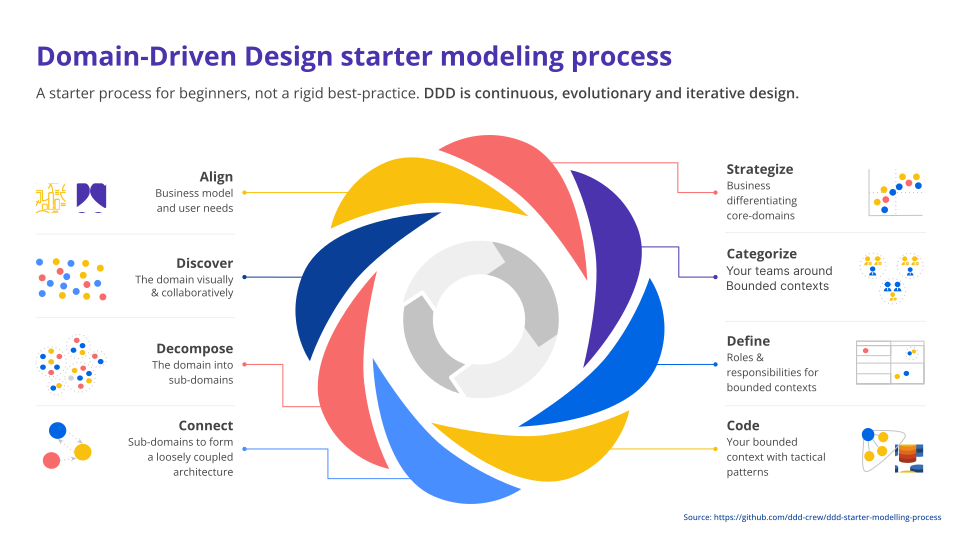
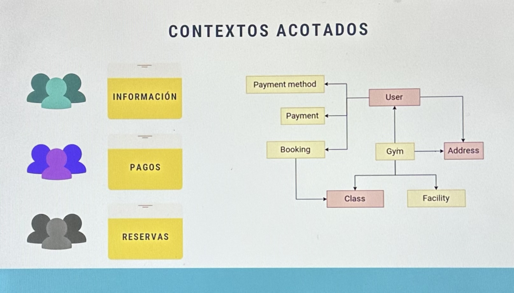
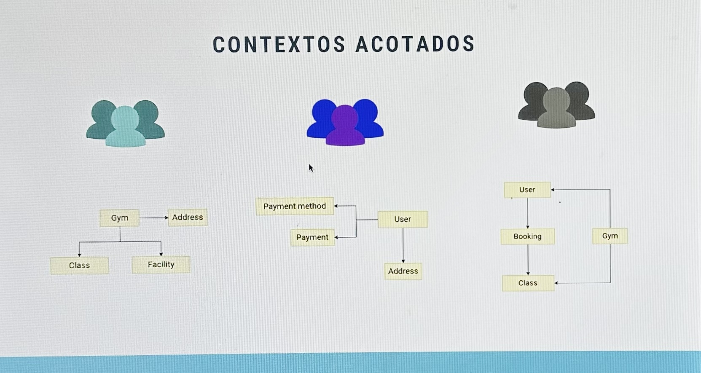
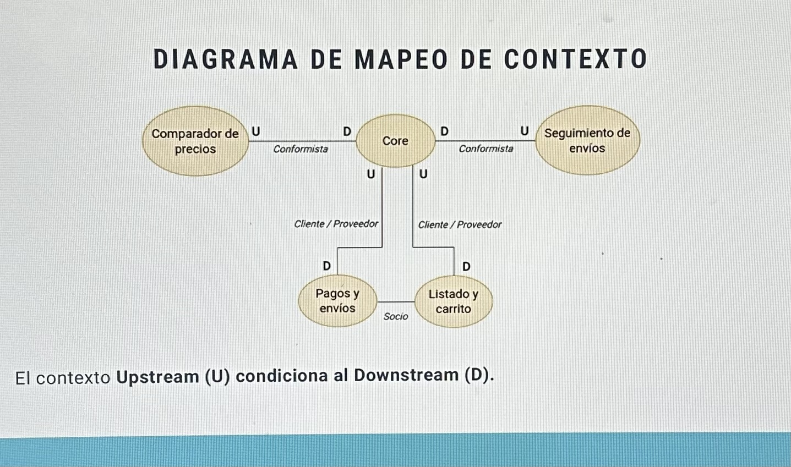
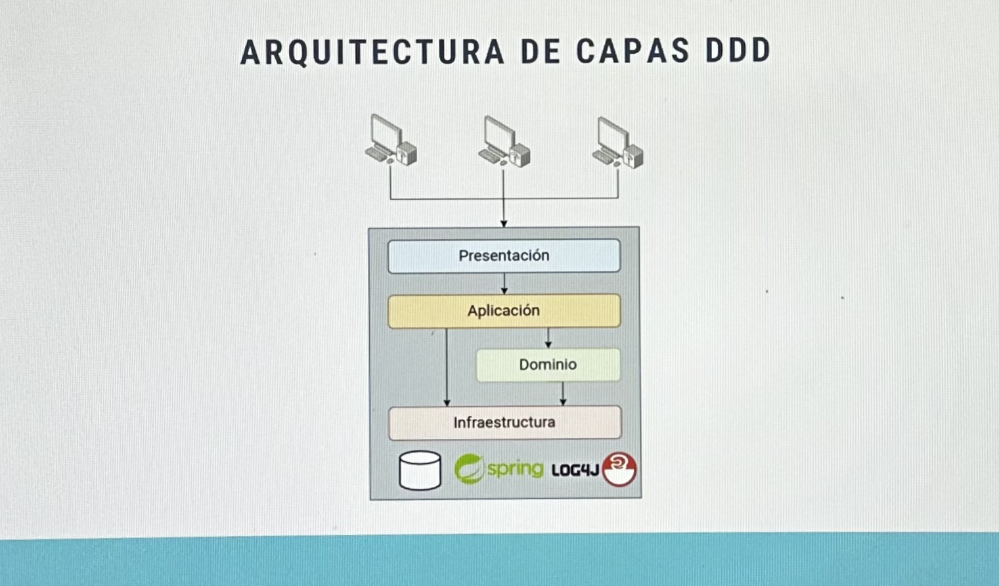
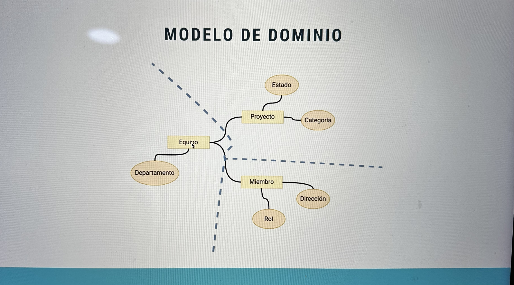
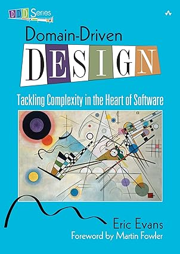
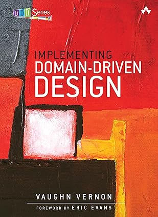

# Domain-Driven Design

- Se piensa primero en el **dominio del problema**; toda la logica central relacionada con el area del problema que se va a resolver. 
- El objetivo es ser expertos en el dominio.
- A continuación, se modelan todas las entidades y reglas especificas del dominio para tenerlas bien claras.
- A partir de ahí, se implementan los casos de uso que queremos resolver, incluyendo el modelo de datos que necesitemos.

Tiempo de desarrollo:

- **El dominio es invariable**, no depende del problema.
- Los **casos de uso son mucho mas inestables**, tienden a cambiar con el tiempo.

> - Separando los casos de uso y las reglas del dominio conseguimos **independizar** dos partes con inestabilidades diferentes.
> - Esto hace que nuestro sistema se mucho mas flexible.

---

## DDD: Tactical Design

**Model-Driven Design**: Hace referencia a que modelemos desde nuestro contexto, es decir, dirigir nuestro diseño en base a los modelos. Esto lo conseguiremos a través de:
- Expresar la Semantica de Dominio en términos de:
  - **Services**
  - **Entities**
  - **Value Objects**
  - **Aggregates**: Elementos conceptuales que nos permitirán mantener la integridad de las entidades y encapsular los value objects.
  - **Repositories**: En los que persistiremos nuestras entidades.
- Cada vez que se produzcan cambios en nuestras entidades lanzaremos **Domain Events**, reflejando que algo ha pasado en nuestro sistema.
- Gracias a los **Factories** podremos encapsular nuestras entidades, agregados y value objects. En los repositorios que utilizamos en los cursos podeis ver ejemplos de cómo implementamos el Factory Pattern.
- Generalmente cuando trabajemos con DDD lo haremos a través de una **Arquitectura por Capas** como es el caso de la Arquitectura Hexagonal.
- Propone el uso de **Ubiquitous Language**, es decir, que los nombres de variables, metodos y clases se establezcan con el lenguaje de nuestro dominio.
- Todo ello se define dentro de un **Bounded Context**, que nos va a permitir una mayor autonomía entre equipos además de establecer límites en el lenguaje.

## DDD: Strategic Design

Dentro de nuestro **Bounded Context**, mantenemos nuestro modelo unificado gracias a la **Integración Continua**. Hablamos de **Context Map** para referirnos al mapeo realizado de los términos que utilizamos en real a conceptos lógicos o físicos. Este mapeo nos ayudará además a:
- Separar el **Big Ball of Mud** de nuestra aplicación, y llevar a cabo la publicación de eventos en lugar de adentrarnos en un código costoso de desacoplar.
- Identificar cómo aplicar el **Anticorruption Layer**.
- Cada equipo puede trabajar de forma separada (Podremos, por ejemplo, utilizar distintos lenguajes de programación para los diferentes contextos de nuestra aplicación).
- Facilita la publicación de **Open Host Services** para la comunicación entre los Bounded Contexts y entre la estructura organizacional de nuestra aplicación (**Published Language**).
- Posibilita la relación entre contextos a través de un **Shared Kernel** y en términos de **Customer/Supplier Team** y de **Conformist**.

---

## Que es el Lenguage Ubicuo?

**Vocabulario comun** que describe el **dominio** del problema a resolver.
  - verbox, nombres, adjetivos, etc. todo lo que necesitemos para definirlo correctamente.

Este vocabulario es **compartido por todos los interesados** del proyecto.
  - PMs, programadores, expertos de dominio, clientes, etc.

Se debe utilizar siempre para **evitar malentendidos**.
  - Evitamos usar sinonimos o palabras del mundo real que podrian significar otra cosa en nuestro dominio.

El objetivo es utilizar un **lenguaje comun, independientemente del rol desempeñado**.

### Caracteristicas del Lenguaje Ubicuo

Se crea a partir de sesiones de **brainstorming** y **analisis del dominio**.
  - Se documenta y debe ser claro y lo menos ambiguo posible.

El lenguaje Ubicuo no es algo estatico, es parte de un proceso iterativo.
  - El lenguaje ubicuo evoluciona a medida que el dominio se comprende mejor.
  - Se revisa y actualiza continuamente a medida que se desarrollan nuevas funcionalidades o se descubren nuevos aspectos del dominio.

Ubicuo: `Que esta presente a un mismo tiempo en todas partes`.
  - Se debe usar en **conversaciones, emails, historias de usuario, codigo, reuniones, etc.**

### Ejemplo

> Como monitor del gimnasio, quiero que los usuarios con tarifa completa se puedan registrar y asistir a clases particulares.

De aqui podemos extraer el siguiente vocabulario ubicuo:

- **Monitor**: Persona encargada de supervisar y guiar a los usuarios en el gimnasio.
- **Gimnasio**: Establecimiento donde se realizan actividades deportivas y de entrenamiento.
- **Usuario**: Persona que asiste al gimnasio y utiliza sus servicios.
- **Tarifa**: Tipo de suscripción que permite acceso total a todas las instalaciones
- **Registro**: Proceso mediante el cual un usuario se inscribe para participar en una actividad o clase.
- **Clases particulares**: Sesiones de entrenamiento personalizadas que se ofrecen a los usuarios.
- **Asistencia**: Proceso de participar en una clase o actividad programada.

---

## Bounded Contexts (Contextos Acotados)

En este diagrama, se identifican diferentes funcionalidades: pagos, reservas e informacion del gimnasio. Que ademas comparten informacion entre ellas.

Es comun que cuando el sistema crece, se divide el trabajo en diferentes equipos, asignando cada uno a una funcionalidad y sus entidades asociadas. Y tienen que trabajar en algunos casos en las entidades compartidas, como ser:

- La entidad `direcciones` es utilizada por los equipos de **Informacion** y **Pagos**.
- La entidad `clases` es utilizada por los equipos de **Informacion** y **Reservas**.
- La entidad `usuarios` es utilizada por todos los equipos.

Haciendo que las modificacioens que haga algun equipo sobre estas entidades compartidas afecten indirectaqmente a los otros equipos.

A continuacion se muestra una mejor forma de diseñar el modelo de nuestra aplicacion:

En este diagrama, cada equipo tiene su propio bounded context, lo que significa que cada uno tiene su propio modelo de datos y logica de negocio.

Cada equipo es responsable de su propio contexto y no tiene que preocuparse por los detalles internos de los otros contextos. Esto permite una mayor independencia y flexibilidad en el desarrollo.

Evidentemente, cada contextos no son totalmente independientes entre si, se sigue necesitando que los contextos cooperen entre si para conseguir una funcionalidad completa.

### Definicion de Bounded Context

Nueva forma de organizr el modelo y logica de negocio **guiado por el dominio**.

- Un contexto acodado es aquel que tiene un sentido especial en el dominio; al final es un sudominio dle dominio completo del problema.
- Cada bounded context tiene su **propio lenguaje ubicuo**.
- Las entidades fuera del `bounded context` pueden tener caracteristicas ligeramente diferentes.

Notas Importantes:
> Tener definida la misma entidad en diferentes contextos **no implica una duplicidad de codigo, sino una aclaracion del mismo**.
>
> Compartiendo el modelo entre contextos, se tiende a acumular detalles e informacion entre ellos, **poniendo en riesgo la integridad del modelo**.

## Mapeo de Contextos

### Dependencias entre distintos contextos

A pesar de que es positivo separar nuestro modelo en bounded contexts, la logica de un sistema de software complejo implica **interaccion entre los distintos contextos**.

- Los contextos no son totalmente independientes entre si.
- Se deben definir claramente las **dependencias** e **interaciones** entre los distintos contextos.

Tipos de relaciones entre contextos:

- **Conformist (Conformista)**. No existe ninguna capacidad de negociacion entre los contextos. El contexto dependiente acepta el modelo del contexto proveedor sin cuestionarlo.
- **Cliente/Proveedor (Customer/Supplier)**. Dependencia con cierto grado de negociacion. El contexto cliente puede solicitar cambios al contexto proveedor, pero este no esta obligado a realizarlos.
- **Partnership (Asociacion)**. Relacion de colaboracion entre contextos. Ambos contextos trabajan juntos para definir el modelo y las interacciones.
- **Shared Kernel (Nucleo Compartido)**. Dos o mas contextos comparten un modelo comun, pero cada uno tiene su propia implementacion. Se requiere una colaboracion estrecha para mantener la coherencia del modelo compartido. Es dificil de mantener y requiere una gran disciplina.
- **Anticorruption Layer (Capa de Anticorrupcion)**. Interfaz que utiliza `Downstream` para interactuar con `Upstream`, sin importar los cambios realizados en el ultimo. Se utiliza para evitar que un contexto externo afecte negativamente a nuestro modelo. Actua como una capa de traduccion entre los dos contextos, permitiendo que cada uno mantenga su propio modelo sin contaminarse mutuamente.
- **Open Host Service/Published Language**. Relaciones de tiupo **conformist** en las que se provee de documentacion al `Downstream` context para que pueda interactuar con el `Upstream` context. El `Upstream` context define un lenguaje de publicacion que el `Downstream` context puede utilizar para interactuar con el `Upstream` context. Ademas se proporciona **versiones** y compatibilidades entre ellas.

---

## Capas de Arquitectura DDD

### Capa de Presentacion

API de entrada a nuestro sistema que da soporta a la interfaz de usuario, ya sea una aplicacion web, movil o cualquier otro tipo de cliente.

Es la fachada e interactua con los servicios de aplicacion para iniciar los casos de uso que se necesiten.

> En frameworks como Spring serian los **@Controller**

Cabe acotar que la capa de presentacion no es equivalente a la interfaz de usuario. En el pasado, se contruia la vista desde el servidor por eso **se consideraba parte de la presentacion**. Ahora es muy comun tener la vista separada en otro proyecto, como una SPA (Single Page Application) o una aplicacion movil; utilizando frameworks como React, Angular, Vue, etc.

### Capa de Aplicacion

Es la encargada de **orquestar** todos los **casos de uso** necesarios para resolver las peticiones de la capa de presentacion.

**Interactura con el dominio** para ejecutar su logica especifica.

**Interactura con la infrastructura** para persistencia, framework, logging, etc.

**Respone a la capa de presentacion** con los resultados de los casos de uso ejecutados.

> En frameworks como Spring serian los **@Service**

### Capa de Dominio

En esta capa residen los **datos y logica central de nuestro sistema**, diseñada bajo los principios DDD.

Esta capa debe estar **lo mas aislada posible del exterior**. Se comunica con la capa de infraestructura  si necesita algun acpecto de logging. 

La capa de dominio no debe saber nada ni de casos de uso de nuestro sistema, ni tampoco detalles de implementacion como podria ser el framework o la base de datos utilizada.

Se compone de entidades de dominio y servicios de dominio. Las entidades de dominio son las que contienen los datos y la logica necesarias para representar el dominio del problema.

- Entidades de dominio:
  - Datos y logica; clases y modulos planos.
  - **NO** son entidades de persistencia (**@Enitty** en Spring), no son tablas de base de datos.

- Servicios de dominio:
  - contiene logica de dominio que no se pueda asignar a una entidad de dominio especifica.
  - Siguen los principios del DDD.
  - **@Service** en Spring, pero no son servicios de aplicacion.
  - Estos servicios pertenecen al lenguage ubicuo del dominio y estan claramente definidos y documentados.

> **NOTA ADICIONAL**
> 
> El uso de @Service de Spring en la capa de dominio contrasta con que la capa de dominio debe estar aislada de la infraestructura, pero evidentemente en el mundo del software no hay nada blanco o negro, es todo una escala de grises.
>
> Aunque siempre es mejor que los servicios de dominio tampoco tengan conocimiento sobre el framework que estamos utilizando, puede ser aceptable utilizarlo como es el caso de @Service de Spring, que simplemente es una anotacion que nos permite inyectar ese servicio en otra clase, consiguiendo asi la inversion de la dependencia. 

### Capa de Infraestructura

Es la capa que interactura con todos los detalles de implementacion especificos como son las persistencia, detalles de framework y otros aspectos de infraestructura.

- Persistencias:
  - Objetos de ORMs (@Entity, etc)
  - Repositorios
- Detalles del Framework
  - Clases de configuracion
  - Arranque de aplicacion
- Otros aspectos de infraestructura
  - Logging
  - Clases de Configuracion
  - etc.

### Dependencias

- **Las flechas indican el flujo de la informacion**, no la dependencia.
- Es importante conseguir la **IoC** (Inversion of Control) usando tecnicas como la inyeccion de dependencias.
- Es importante que el **dominio sea lo mas estable** de nuestro sistema.
- Nunca debemos modificar nuestro dominio para adaptarlo al exterior, como por ejemplo base de datos, frameworks, etc cualquier detalle de implementacion.
- En ese caso, lo apropiado es adaptar la capa de infraestructura. Siempre debemos modificar primero capas exteriores al dominio, y nunca al reves.
- La capa de dominio no se debe modificar nunca (se refiere a codigo ya existente), solo se debe agregar nueva funcionalidad.
- Evidentemente esta capa debe cumplir el principio Solid de **Open Closed Principle** (Principio Abierto/Cerrado), es decir, debe estar abierto para agregar nueva funcionalidad, pero cerrado para modificaciones.

---

## Modelado de Dominio

Por poner un ejemplo, pensemos en el caso de una compañia de software que se divide en equipo de X miembros que trabajan en diferentes proyectos.

Cuando empezamos a modelar en el dominio, lo normal es empezar a definir las entidades de dominio y sus relaciones. Las entidades que vemos aqui son: Equipo, Proyecto y Miembro.

Ademas, existen ciertos atributos relacionados con cada entidad, como son:
- `estado` y `categoria` de un proyecto.
- `direccion` y `rol` de un miembro.
- `departamento` de un equipo.

Estos son conocidos como objetos de valor, **Value Objects**, que son objetos que no tienen identidad propia, sirven como atributos de nuestras entidades, solo tienen datos y no implementan nignuna logica. Por ejemplo, un objeto de valor `Direccion` puede tener atributos como `calle`, `numero`, `ciudad`, etc.

Tambien podemos observar, tenemos 3 conceptos claramente diferenciados: Proyectos, Equipos y Miembros. Cada uno de estos conceptos diferentes es conocido como **Aggregate**. Cada Aggregate tendra una entidad raiz, en este caso las entidades `Proyecto`, `Equipo` y `Miembro`, ademas de ValueObjects relacionados.

Tambien pueden existir entidades secundarias en lo **Aggregates**. Estas entidades tienen datos y logica, pero no son la entidad raiz del Aggregate. Por ejemplo, en el caso de un `Proyecto`, puede existir una entidad secundaria llamada `Tarea`, que tiene datos y logica relacionada con las tareas del proyecto, pero no es la entidad raiz del Aggregate.

### Elementos del Modelo de Dominio

**Entidades**.
- Clases con datos y comportamiento.

**Value Objects (Objetos de Valor)**. 
- Clases con datos, sin comportamiento.
- Sirven para representar de manera mas clara los atributos de las entidades.
- No tienen identidad propia, son inmutables.

**Aggregates**
- Grupos de entidades y Value Objects.
- Separan conceptos diferentes de nuestro dominio.

> Como norma general, la comunicacion entre distintos Aggregates se realiza a traves de la raiz de los mismos. Una raiz no puede acceder a otro elemento no raiz de un aggregate directamente.
>
> Por ejemplo, si necesitamos modificar el `rol` de un miembro de un equipo, esto se debe hacer a traves de la entidad `miembro` y no accediendo directamente al value object `rol`. Con esto nos aseguramos de que cada Aggregate sea responsable de la consistencia de sus propios datos y logica de sus entidades y value objects. Cada aggregate tendra, por asi decirlo, una API que es la raiz de ese aggregate, que es por la cual pasaran todas las interaciones desde otros aggregates.

---

## Resumen

### La importancia del Dominio

- El DDD se centra en la importacia de **entender bien el dominio** de nuestro problema para crear buen software.
  - En contraste con el enfoque tradicional de centrarse en la tecnologia o en los casos de uso.

Para identificar los elemnetos del dominio del problema, se deben seguir los siguientes pasos:
- Establecer el **Lenguaje Ubicuo**, que es donde se documenta y define todos los nombres, adjetivos y vertos que teienen que ver con el dominio del problema. Para ello, se deben realizar sesiones de **brainstorming** y **analisis del dominio**.
- Identificar los **Bounded Contexts**, dividir el dominio completo del sistema en bounded contexts, que son subdominios del dominio completo del sistema. Cada bounded context tiene su propio lenguaje ubicuo y sus propias entidades y reglas de negocio.
- Modelado del Dominio, que es un diagrama que refleja la comunicacion y las dependencias entre los distintos bounded contexts. En este diagrama se identifican las entidades, value objects y aggregates que componen el dominio del problema.

Todo esto se hace con el fin de **separar la logica de la aplicacion** (casos de uso) **de la logica del dominio**,
- Los casos de uso varian mucho mas frecuentemente que las reglas del dominio.

### Modelar el dominio

**Entidades**
- Elemnentos del dominio con entidad propia.
- Estas tienen comportamiento y datos.

**Value Objects**
- Elementos que solo almacenan datos.
- Creados para representar de forma mas clara los atributos de las entidades.

**Aggregates**
- Conjunto de entidades y value objects con un sentido comun en el dominio.

**Domain Services**
- Son elementos del dominio con logica que no tienen cabida en ninguna de las entidades.

---

## Pros y Contras del DDD

### Aspectos Positivos

- **Lenguaje comun compartido** por todso los integrados del proyecto. Perfiles tecnicos y no tecnicos; evitando malentendidos.
- Al tener logica de aplicacion y dominio separadas, el **coste de realizar modificaciones suele ser menor**, ya que el dominio es mas estable.
- El codigo del dominio es autoexplicativo, es decir, el codigo refleja el dominio del problema y es facil de entender.
- **Mayor velocidad de desarrollo a medio y largo plazo**. Mucho mas mantenible.

### Aspectos Negativos

- El desarrollo es **mas lento al principio** de un proyecto, ya que es una arquitectura mas complejo y requiere mas tiempo de analisis y diseño.
- Require tener **expertos en el dominio del problema**
- Cambio de mentalidad de los desarrolladores para enfocarse en las funcionalidades mas que en los datos.
- Los frameworks actuales nos "empujan" a un modelo anemico y a pensar centrandonos en los datos.
### Cuando Usar DDD?

- Proyectos complejos con un **largo tiempo de vida esperado**
- Cuando hay una **incertidumbre en los casos de uso**. Prevision de cambios en el futuro.
- Problemas con una **logica de dominio presente**. Si lo unico que necesitas es un CRUD, no es necesario usar DDD.
- Disponibilidad de un equipo comprometido en analizar detalladamente el dominio del problema.

---

#### Referencias para mayor informacion:

<table>
  <tr>
    <td align="center">
      
    </td>
    <td align="center">
      
    </td>
  </tr>
</table>