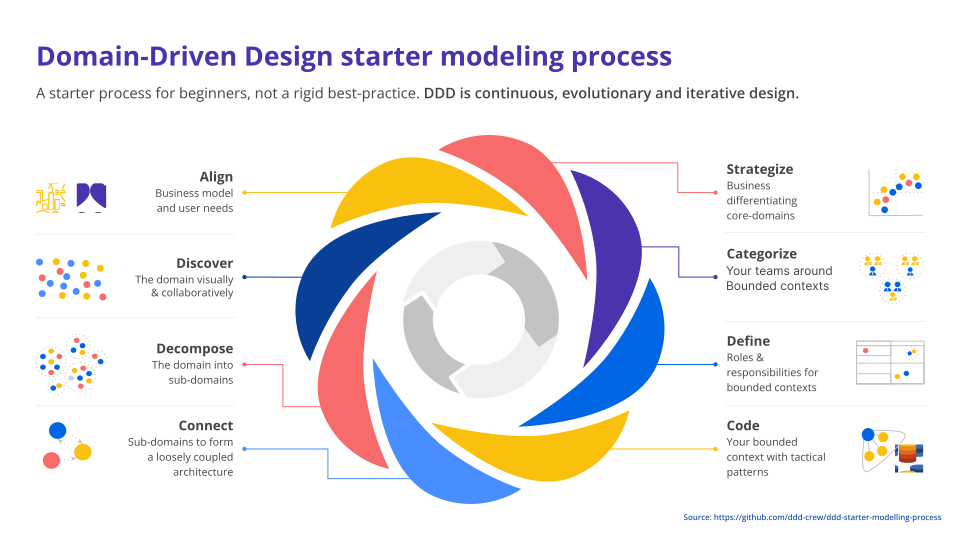

# Domain-Driven Design

- Se piensa primero en el **dominio del problema**; toda la logica central relacionada con el area del problema que se va a resolver. 
- El objetivo es ser expertos en el dominio.
- A continuación, se modelan todas las entidades y reglas especificas del dominio para tenerlas bien claras.
- A partir de ahí, se implementan los casos de uso que queremos resolver, incluyendo el modelo de datos que necesitemos.

Tiempo de desarrollo:

- **El dominio es invariable**, no depende del problema.
- Los **casos de uso son mucho mas inestables**, tienden a cambiar con el tiempo.

> - Separando los casos de uso y las reglas del dominio conseguimos **independizar** dos partes con inestabilidades diferentes.
> - Esto hace que nuestro sistema se mucho mas flexible.

- [DDD: Tactical & Strategic Design](./ddd-tactical-strategic-design.md)

- [Lenguaje Ubicuo](./ubiquitous-language.md)

- [Bounded Contexts](./bounded-context.md)

- [Arquitectura por Capas](./architecture-layers.md)

- [Modelado de Dominio](./domain-modeling.md)

- [Resumem](./summary.md)

- [Pros y Contras del DDD](./pros-and-cons.md)

- [Referencias](./references.md)